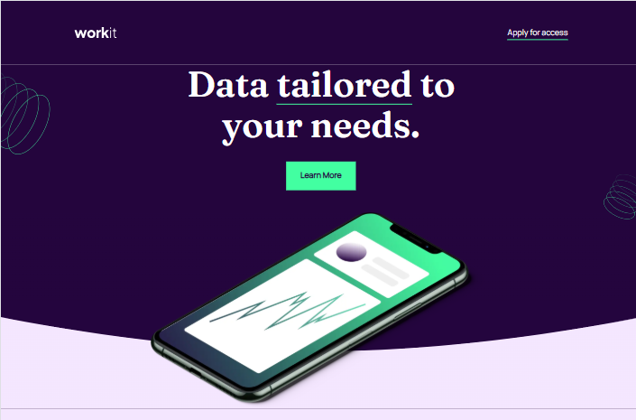
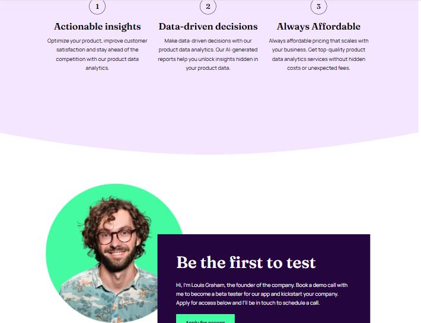

# Workit — Landing Page

A modern, responsive landing page for a hypothetical agency called **Workit**.
This project is a production-ready static UI focused on clarity, typography, and accessibility, ideal for portfolio showpieces or as a starting point for a marketing site.

---

## Table of contents

- [About](#about)
- [Preview](#preview)
- [Features](#features)
- [Tech stack](#tech-stack)
- [Project structure](#project-structure)
- [Accessibility & best practices](#accessibility--best-practices)
- [Performance & optimization notes](#performance--optimization-notes)
- [Author / Contact](#author--contact)

---

## About

**Workit** is a clean, responsive landing page built with semantic HTML and modern CSS. The design emphasizes readable typography, clear hierarchy, and accessible markup. It demonstrates layout techniques using CSS Grid and Flexbox and follows a mobile-first approach.

---

## Preview

Open `index.html` in your browser or use a static server to preview the site locally.

### Mobile


### Desktop




---

## Features

- Mobile-first, responsive layout (Grid & Flexbox)
- Semantic HTML for improved accessibility and SEO
- Custom web fonts (Manrope & Fraunces) with `font-display: swap`
- Optimized images (WebP assets included)
- Reusable BEM-like CSS class naming and utility helpers
- Accessible visually-hidden heading for screen readers
- Hover / focus states for interactive elements (buttons & links)
- Clean, easily extensible CSS architecture

---

## Tech stack

- HTML5
- CSS3 (Grid, Flexbox, custom properties, clamp() for fluid type)
- Static assets (WebP images, WOFF2 fonts)

_No build tools required — purely static._

---

## Project structure

```
workit-landing-page/
├─ index.html
├─ css/
│  └─ styles.css
├─ assets/
│  ├─ images/
│  └─ fonts/
└─ README.md
```

Key files:

- `index.html` — semantic markup and content
- `css/styles.css` — main stylesheet (typography, layout, components)
- `assets/` — images and font files used in the design

---

## Accessibility & best practices

- Semantic headings (`h1`, `h2`, `h3`) and landmarks (`header`, `main`, `footer`) are used to support assistive tech.
- Visually hidden elements (`.visually-hidden`) maintain accessibility without affecting layout.
- Buttons and links provide visible focus/hover states for keyboard users.
- Use descriptive `alt` text for images; replace placeholder `alt` values with meaningful descriptions for production.

---

## Performance & optimization notes

- Fonts use `woff2` and `font-display: swap` to reduce FOIT (flash of invisible text).
- Images are provided in WebP format to reduce payload. Keep image dimensions and `width`/`height` attributes to minimize layout shift.
- CSS is componentized and uses `clamp()` for fluid typography to avoid heavy runtime layout changes.

---

## Author

GitHub: `https://github.com/Lewis-mbui`

---

## Roadmap / Future improvements

- Add a small build step (PostCSS + autoprefixer, minification) for production.
- Convert layout to a component-based system (SCSS or CSS Modules) for larger projects.
- Add light/dark theme toggle.
- Add simple analytics and A/B testing hooks (privacy-friendly).
- Make the site fully WCAG 2.1 AA compliant (audit and fix any contrast/focus issues).

---
